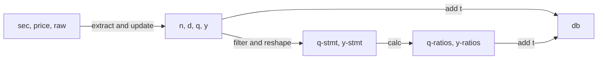

# inVisement.com
Hedge Fund As A Service
- We trust in machine
- Machine Learning for Finance
- Financial Data Provider
- Fund Management and Portfolio Recommendation
- Cloud solutions to Financial Firms

## Future features
- reading from html submissions instead of xml for sec submissions
- running through all years for complete dataset (xmls by cik)
- Upload historical price data
- Create "back in time machine" for back-testing, data transaction with record stamp

## Process

## Architecture
It deploys these components
- dev: my local machine
    - ali@fedora
    - Linux Fedora with git, python 3.6, bash, gsutil, hugo, markdown
    - For everything and development and test
- control: google compute engine free micro machine
    - ali@sec
    - Just for scheduling and controling jobs in other machies
    - Sometimes as a light prototype machine such as flask microservice server
    - Linux Debian Stretch, bash and cron, gsutil
- paid (modeler): google compute 13gb 2vCPU machine
    - ali@paid
    - runs daily jobs assigned by Control and go to bed
    - gets new models (python codes) from git when Dev says
    - python 3.6, git
- static/blob: google storage
    - gs://sec.finmint.us
    - for holding static .csv file precompressed and serving http
- dns: google domain
    - sec.finmint.us to google storage
- git: in github.com/finmint/sec
    - for version control hub of every code
    - exclude file (in config folder) excludes all files inside data and dot (*data/* and .*/*)

Backup plan:
    - codes are in 3 places: dev, github, paid
    - data are in 2 places: paid (files), static (compressed objects)

_________________

## Data

- source:
    - google_finance
    - sec_datasets
    - sec_xls_submissions
    - ticker_info
    - rank and filed (for sec data)
- extract
    - sec
    - goog
    - ticker
- transform/staging
    - accounting/stmts/fun
- delivery/target/load
    - 10K
    - 10Q
___________________

## Modules
- extract (source): input
    - extract_goog_fin
    - extract_sec_datasets
    - extract_sec_xls_submissions
    - extract_ticker
- transform (input): op
    - transform_goog (right now: ali)
    - transform_sec
- load (op): target
___________________

## Language
Python 3.6+
___________________

## Objectives
1. API call to fetch "distilled/processed" financial data about all US stocks
    * Daily Prices
    * Fundemental: Income Statement, Balance Sheet, Cash Flow
2. API call to provide "intrinsic value" of a stock based on Machine Learning and Asset Pricing
3. API call to provide "best/better investment" similar to a given stock
4. API call to analyze the performance of a portfolio
5. API call to clean SEC 10k and 10Q data and pickle
_________

## Phase1: API call to fetch financial Data
    HFetch (FirmSymbol, Frequency='D', Start_date, End_date, Statement='Price', Item)
    * Load data (Price and Fundemental) into class Firm and pickle
    * readIn method from csv file
    * downLoad method from websites
___________

## Iteration 1.1: file name: Firm.py
- Readin 1 Quarter (2017Q3) data from SEC Edgar:
ReadSEC(url="https://www.sec.gov/files/dera/data/financial-statement-data-sets/", file="2017q3.zip") -> Data.DataSet
    - Download from: https://www.sec.gov/files/dera/data/financial-statement-data-sets/2017q3.zip
    - Store it in proper format (To Discuss!!!)
    - Write it into DataBase format or BigData format (Extra feature)
- Read in 7 files from finance.google and store it in proper format and write a program to do it automatically
- Transform IBM from quarterly to standard format (as in google)
___________
## Done so-far:
- Read Financial Stamenets From Google Finance:
    - Available Data: 2014Q1-2017Q3
    - Module: downGoogle
    - Purpose: to use a benchmark
- Financial Statements from EDGAR (Historic quarterly)
    - Available Data: 2009Q1-2017Q3
    - Module: sec2df
    - Purpose: the main source of financial statements
- Module: extract_sec_from_xls_submissions.py
    - purpose:
        - Read daily 10-K, 10-Q submissions by firms to sec (Delta)
    - API:
        - call: extract_xls_submissions
        - args: (sec, new_idx_url, old_idx_path)
        - output: pd.DataFrame 
    - Functions:
        - extract_xls_submissions
        - extract_sheet
        - extract_date
        - extract_quarter
        - extract_unit
        - extract_value
    - references:
        - https://www.sec.gov/Archives/edgar/full-index/
_____________________

## To-Do
- (Later, not necessary): create a pd.Series to store all key-value things like path, directories, names, urls, ... (to discuss)

- Make a matching list of items from SEC to Google

- Create final datasets:
    - 10-K, 10-Q (raw data)
    - A, Q (standard data)
    - Covers 10 years and 8000 companies

- Fill the missing data for datasets

- Contact with Quandl and others to sell
___________________

## License
- All rights belongs to the contributors
______________

## Data Source references:
- Financial Satements Datasets:
https://www.sec.gov/dera/data/financial-statement-data-sets.html

- Latest 10-Q reports on Edgar:
https://www.sec.gov/cgi-bin/browse-edgar?&type=10-Q&count=100&action=getcurrent&output=atom

- Accessing EDGAR data:
https://www.sec.gov/edgar/searchedgar/accessing-edgar-data.htm

- CIK lookup:
https://www.sec.gov/Archives/edgar/cik-lookup-data.txt
https://www.sec.gov/divisions/corpfin/organization/cfia-123.htm
https://www.sec.gov/cgi-bin/current?q1=0&q2=0&q3=
ftp://ftp.nasdaqtrader.com/SymbolDirectory/

- SIC code:
https://www.sec.gov/info/edgar/siccodes.htm

- Researching Edgar:
https://www.sec.gov/oiea/Article/edgarguide.html

- Edgar Developer Resource page:
https://www.sec.gov/developer

- Google Finance:
finance.google.com

www.nyse.com

www.nasdaq.com

rank and filed:
http://rankandfiled.com/#/data/tickers
http://rankandfiled.com/#/public/ABG/financials

company list by ticker:
https://www.nasdaq.com/screening/company-list.aspx
___________________
## Trash
__________________
